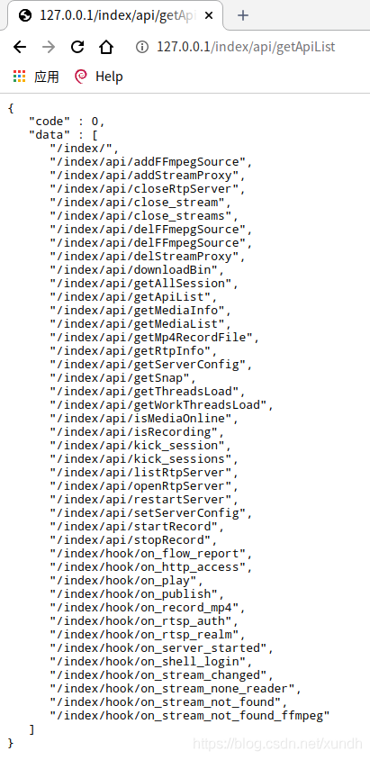
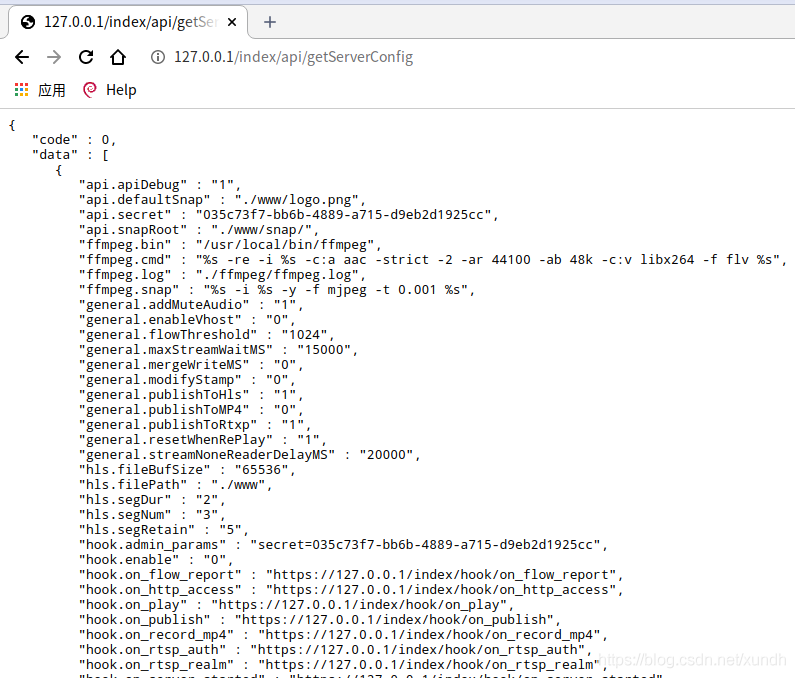

# ZLMediaKit库入门使用 编译安装

音视频开发5. ZLMediaKit库入门使用 编译安装
一、 ZLMediaKit 库简介
二、编译
三、生成物

1. MedisServer
2. SDK (c语言)
3. 测试程序
4. 问题处理
   四、测试
5. rtsp 推流测试
6. rtp 方式推流
7. 测试http api
   (1) getApiList
   (2) /index/api/getServerConfig
   (3) /index/api/getMediaList
8. Http Hook


## 一、 ZLMediaKit 库简介 ##

ZLMediaKit 是一个基于C++11的高性能运营级流媒体服务框架

官方写的项目特点：

- 基于C++11开发，避免使用裸指针，代码稳定可靠，性能优越。
- 支持多种协议(RTSP/RTMP/HLS/HTTP-FLV/Websocket-FLV/GB28181/MP4),支持协议互转。
- 使用多路复用/多线程/异步网络IO模式开发，并发性能优越，支持海量客户端连接。
- 代码经过长期大量的稳定性、性能测试，已经在线上商用验证已久。 支持linux、macos、ios、android、windows全平台。
- 支持画面秒开、极低延时(500毫秒内，最低可达100毫秒)。 提供完善的标准C API,可以作SDK用，或供其他语言调用。
- 提供完整的MediaServer服务器，可以免开发直接部署为商用服务器。 提供完善的restful api以及web hook，支持丰富的业务逻辑。 打通了视频监控协议栈与直播协议栈，对RTSP/RTMP支持都很完善。
- 全面支持H265/H264/AAC/G711/OPUS。
- 其功能非常多，支持RTSP、RTMP[S]、HLS、GB28181等多种流媒体格式。

## 二、编译 ##

测试环境： 深度系统（Deepin20）

```
#国内用户推荐从同步镜像网站gitee下载 
git clone --depth 1 https://gitee.com/xia-chu/ZLMediaKit
cd ZLMediaKit
#千万不要忘记执行这句命令
git submodule update --init

# 安装gcc

sudo apt-get install build-essential

# 安装cmake

sudo apt-get install cmake

# 安装依赖库

#除了openssl,其他其实都可以不安装
sudo apt-get install libssl-dev -y
sudo apt-get install libsdl-dev -y
sudo apt-get install libavcodec-dev -y
sudo apt-get install libavutil-dev -y
sudo apt-get install ffmpeg -y

# 构建和编译项目

cd ZLMediaKit
mkdir build
cd build
cmake ..

# 如果编译release版本 使用 cmake .. -DCMAKE_BUILD_TYPE=Release

make -j4
```

https://gitee.com/xia-chu/ZLMediaKit/wikis/%E5%BF%AB%E9%80%9F%E5%BC%80%E5%A7%8B?sort_id=2009070

## 三、生成物 ##

编译完成后，生成release目录 ， 主要的目标文件有三种

**1. MedisServer**

```
   cd ZLMediaKit/release/linux/Debug
   #通过-h可以了解启动参数
   ./MediaServer -h
   #以守护进程模式启动
   ./MediaServer -d &
```

**2. SDK (c语言)**

   头文件： ZLMediaKit/api/include
   库文件： ZLMediaKit/release/linux/Debug/libmk_api.so

**3. 测试程序**

   在 ZLMediaKit/tests 下。

**4. 问题处理**

   提示： error while loading shared libraries: libssl.so.10: cannot open shared object file: No such file or directory

```
# 复制libssl库，从其它电脑复制或自行编译下面库文件，放到/usr/lib64目录下

# libcrypto.so.1.0.0

# libssl.so.1.0.0

# 建立软连接

ln -s libssl.so.1.0.0 libssl.so.10
ln -s libcrypto.so.1.0.0 libcrypto.so.10
```

## 四、测试 ##

**1. rtsp 推流测试**

```
   # h264推流
   
   ffmpeg -re -i "/path/to/test.mp4" -vcodec h264 -acodec aac -f rtsp -rtsp_transport tcp rtsp://127.0.0.1/live/test
   
   # h265推流
   
   ffmpeg -re -i "/path/to/test.mp4" -vcodec h265 -acodec aac -f rtsp -rtsp_transport tcp rtsp://127.0.0.1/live/test
```

**2. rtp 方式推流**

```
   # h264推流
   
   ffmpeg -re -i "/path/to/test.mp4" -vcodec h264 -acodec aac -f rtp_mpegts rtp://127.0.0.1:10000
   
   # h265推流
   
   ffmpeg -re -i "/path/to/test.mp4" -vcodec h265 -acodec aac -f rtp_mpegts rtp://127.0.0.1:10000
```

   日志格式：

```
2020-04-10 12:51:52.331 I | regist rtsp __defaultVhost__ rtp 206442D7
                                    ^           ^         ^      ^
                                  schema      vhost      app stream_id
```

**3. 测试http api**

本地测试不需要带secret参数
完整文档位置：
https://github.com/xia-chu/ZLMediaKit/wiki/MediaServer%E6%94%AF%E6%8C%81%E7%9A%84HTTP-API

这里仅测试几个接口看看：

**(1) getApiList**

返回所有API接口



**(2) /index/api/getServerConfig**

获取服务器配置



**(3) /index/api/getMediaList**

获取流列表，可以筛选参数。

**4. Http Hook**

   把内部事件使用http post方式通知出来。
   [详细文档](https://github.com/xia-chu/ZLMediaKit/wiki/MediaServer%E6%94%AF%E6%8C%81%E7%9A%84HTTP-HOOK-API)
   相关配置：

```
[hook]
enable=1
admin_params=secret=035c73f7-bb6b-4889-a715-d9eb2d1925cc
timeoutSec=10

on_flow_report=https://127.0.0.1/index/hook/on_flow_report
on_http_access=https://127.0.0.1/index/hook/on_http_access
on_play=https://127.0.0.1/index/hook/on_play
on_publish=https://127.0.0.1/index/hook/on_publish
on_record_mp4=https://127.0.0.1/index/hook/on_record_mp4
on_rtsp_auth=https://127.0.0.1/index/hook/on_rtsp_auth
on_rtsp_realm=https://127.0.0.1/index/hook/on_rtsp_realm
on_shell_login=https://127.0.0.1/index/hook/on_shell_login
on_stream_changed=https://127.0.0.1/index/hook/on_stream_changed
on_stream_none_reader=https://127.0.0.1/index/hook/on_stream_none_reader
on_stream_not_found=https://127.0.0.1/index/hook/on_stream_not_found
on_server_started=https://127.0.0.1/index/hook/on_server_started
```

————————————————

版权声明：本文为CSDN博主「编程圈子」的原创文章，遵循CC 4.0 BY-SA版权协议，转载请附上原文出处链接及本声明。

原文链接：https://blog.csdn.net/xundh/article/details/108381888
