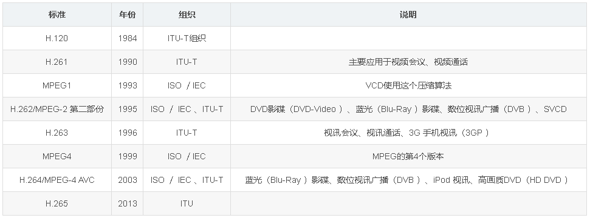
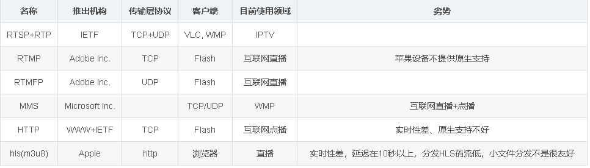

# 音视频开发1. 基本概念及媒体协议 #

```
一、概述
	1. 应用场景
	2. 相关技术
	3. 一些概念
		(1) 编解码 codec
		(2) 容器
		(3) 采样率
		(4) 分辨率
		(5) 帧率 fps
		(6) 压缩
	4. 开源系统
二、算法与协议
	1. 视频编码标准
	2. 主要流媒体协议
三、网页播放音视频方案
	1. rtmp + 插件（非Flash）
	2. rtsp+插件
	3. Flash插件(jwplayer)
	4. 流媒体转为websocket
	5. webRtc
```

## 一、概述 ##

本系列文章主要是收集与整理音视频直播、点播、监控等技术开发及应用，狭义上可特指流媒体的技术应用。

**1. 应用场景**

- 直播
- 点播
- 语音、视频通话
- 监控
- 结合应用，如多媒体音视频会议系统

**2. 相关技术**

- 网络通讯
- 编码、解码
- 推流、拉流
- 
**3. 一些概念**

**(1) 编解码 codec**

对数据或信号进行变化的设备或程序。

**(2) 容器**

对多种媒体资源或字幕等进行包装。对数据进行容器化包装就称为封装，常见的封装格式是与文件扩展名相关的，如：*.mpg, *.avi, *.mov, *.mp4, *.rm, *.ogg or *.tta

**(3) 采样率**

物理和数学概念，以一种速度提取数字信号，单位是赫兹Hz。

**(4) 分辨率**

通常指图像或视频的尺寸。

**(5) 帧率 fps**

视频格式每秒钟播放的静态画面数量。

**(6) 压缩**

对数字信号压缩体积，分为两种：

- 无损格式，例如WAV，PCM，TTA，FLAC，AU，APE，TAK，WavPack(WV)
- 有损格式，例如MP3，Windows Media Audio（WMA），Ogg Vorbis（OGG），AAC

**4. 开源系统**

ffmpeg 知名的流媒体开发工具包，2004年至2015年间由Michael Niedermayer主要负责维护。

VLC Media Player：开源的跨平台多媒体播放器及框架,可播放大多数多媒体文件。

## 二、算法与协议 ##

**1. 视频编码标准**

主要有：MPEG-n和 H.n 两种技术：



```
标准	年份	组织	说明
H.120	1984	ITU-T组织	
H.261	1990	ITU-T	主要应用于视频会议、视频通话
MPEG1	1993	ISO ／IEC	VCD使用这个压缩算法
H.262/MPEG-2 第二部份	1995	ISO ／ IEC 、ITU-T	DVD影碟（DVD-Video ）、蓝光（Blu-Ray ）影碟、数位视讯广播（DVB ）、SVCD
H.263	1996	ITU-T	视讯会议、视讯通话、3G 手机视讯（3GP ）
MPEG4	1999	ISO ／IEC	MPEG的第4个版本
H.264/MPEG-4 AVC	2003	ISO ／ IEC 、ITU-T	蓝光（Blu-Ray ）影碟、数位视讯广播（DVB ）、iPod 视讯、高画质DVD（HD DVD ）
H.265	2013	ITU	
```

**2. 主要流媒体协议**



```
名称	推出机构	传输层协议	客户端	目前使用领域	劣势
RTSP+RTP	IETF	TCP+UDP	VLC, WMP	IPTV	
RTMP	Adobe Inc.	TCP	Flash	互联网直播	苹果设备不提供原生支持
RTMFP	Adobe Inc.	UDP	Flash	互联网直播	
MMS	Microsoft Inc.		TCP/UDP	WMP	互联网直播+点播
HTTP	WWW+IETF	TCP	Flash	互联网点播	实时性差、原生支持不好
hls(m3u8)	Apple	http	浏览器	直播	实时性差，延迟在10秒以上，分发HLS码流低，小文件分发不是很友好
```

总结：

- PC/Phone+直播+实时性要求高：使用flash播放RTMP。
- PC/Phone+直播+没有实时性要求：使用RTMP或者HLS均可。
- PC/Phone+点播：使用HTTP或者HLS。
- Phone+WEB+直播：HLS。

目前webRTC在web播放领域是后起之秀，发展迅猛。

其它协议：


- H.323：是ITU-T第16工作组的建议，由一组协议构成，其中有负责音频与视频信号的编码、解码和包装；

## 三、网页播放音视频方案 ##

**1. rtmp + 插件（非Flash）**

- ckplayer
- vlc 插件
- quicktime
- kurento
- vgx

**2. rtsp+插件**

- streamedia(支持Chrome无插件播放)
- vlc player(不支持RTP/AVP传输的NAT穿孔)
- quicktime
- Realplayer(本身不支持H.264)

**3. Flash插件(jwplayer)**

- Server(Red5) + 使用RTMP直播协议
- ffmpeg + xuggle => rtsp转rtmp => flash插件
- ffmpeg + jwplayer

**4. 流媒体转为websocket**

- ffmpeg + stream-server(nodejs脚本) + h5 Canvas显示
- ffmpeg + jsmpeg
- ffmpeg + xuggle + h5 video
- ffmpeg + websocket(server) + streamedian.js（开源）

**5. webRtc**

主流浏览器已经支持，但H.265解码成熟方案不多见。

参考文章：

https://blog.csdn.net/leixiaohua1020/article/details/18893769

https://www.cnblogs.com/pengmn/p/10316232.html

————————————————

版权声明：本文为CSDN博主「编程圈子」的原创文章，遵循CC 4.0 BY-SA版权协议，转载请附上原文出处链接及本声明。

原文链接：https://blog.csdn.net/xundh/article/details/95053078