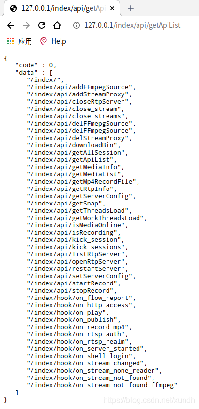
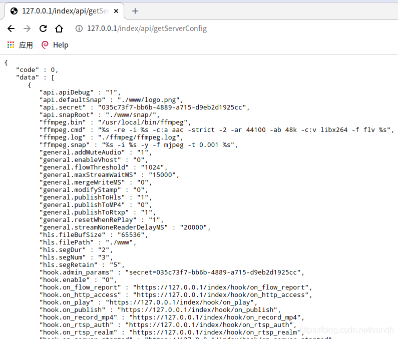

# 音视频开发5. ZLMediaKit库入门使用 编译安装

```
一、 ZLMediaKit 库简介
二、编译
三、生成物
	1. MedisServer
	2. SDK (c语言)
	3. 测试程序
	4. 问题处理
四、测试
	1. rtsp 推流测试
	2. rtp 方式推流
	3. 测试http api
	   (1) getApiList
	   (2) /index/api/getServerConfig
	   (3) /index/api/getMediaList
	4. Http Hook
```

## 一、 ZLMediaKit 库简介 ##

ZLMediaKit 是一个基于C++11的高性能运营级流媒体服务框架

**官方写的项目特点：**

- 基于C++11开发，避免使用裸指针，代码稳定可靠，性能优越。
- 支持多种协议(RTSP/RTMP/HLS/HTTP-FLV/Websocket-FLV/GB28181/MP4),支持协议互转。
- 使用多路复用/多线程/异步网络IO模式开发，并发性能优越，支持海量客户端连接。
- 代码经过长期大量的稳定性、性能测试，已经在线上商用验证已久。 支持linux、macos、ios、android、windows全平台。
- 支持画面秒开、极低延时(500毫秒内，最低可达100毫秒)。 提供完善的标准C API,可以作SDK用，或供其他语言调用。
- 提供完整的MediaServer服务器，可以免开发直接部署为商用服务器。 提供完善的restful api以及web hook，支持丰富的业务逻辑。 打通了视频监控协议栈与直播协议栈，对RTSP/RTMP支持都很完善。
- 全面支持H265/H264/AAC/G711/OPUS。

其功能非常多，支持RTSP、RTMP[S]、HLS、GB28181等多种流媒体格式。

## 二、编译 ##

测试环境： 深度系统（Deepin20）

```
#国内用户推荐从同步镜像网站gitee下载 
git clone --depth 1 https://gitee.com/xia-chu/ZLMediaKit
cd ZLMediaKit
#千万不要忘记执行这句命令
git submodule update --init

# 安装gcc

sudo apt-get install build-essential

# 安装cmake

sudo apt-get install cmake

# 安装依赖库

#除了openssl,其他其实都可以不安装
sudo apt-get install libssl-dev -y
sudo apt-get install libsdl-dev -y
sudo apt-get install libavcodec-dev -y
sudo apt-get install libavutil-dev -y
sudo apt-get install ffmpeg -y

# 构建和编译项目

cd ZLMediaKit
mkdir build
cd build
cmake ..

# 如果编译release版本 使用 cmake .. -DCMAKE_BUILD_TYPE=Release

make -j4
```

https://gitee.com/xia-chu/ZLMediaKit/wikis/%E5%BF%AB%E9%80%9F%E5%BC%80%E5%A7%8B?sort_id=2009070

## 三、生成物 ##

编译完成后，生成release目录 ， 主要的目标文件有三种

**1. MedisServer**

```
   cd ZLMediaKit/release/linux/Debug
   #通过-h可以了解启动参数
   ./MediaServer -h
   #以守护进程模式启动
   ./MediaServer -d &
```

**2. SDK (c语言)**

```
   头文件： ZLMediaKit/api/include
   库文件： ZLMediaKit/release/linux/Debug/libmk_api.so
```

**3. 测试程序**

   在 ZLMediaKit/tests 下。

**4. 问题处理**


> 提示： error while loading shared libraries: libssl.so.10: cannot open shared object file: No such file or directory

```
# 复制libssl库，从其它电脑复制或自行编译下面库文件，放到/usr/lib64目录下

# libcrypto.so.1.0.0

# libssl.so.1.0.0

# 建立软连接

ln -s libssl.so.1.0.0 libssl.so.10
ln -s libcrypto.so.1.0.0 libcrypto.so.10
```

## 四、测试 ##

**1. rtsp 推流测试**

```
   # h264推流
   
   ffmpeg -re -i "/path/to/test.mp4" -vcodec h264 -acodec aac -f rtsp -rtsp_transport tcp rtsp://127.0.0.1/live/test
   
   # h265推流
   
   ffmpeg -re -i "/path/to/test.mp4" -vcodec h265 -acodec aac -f rtsp -rtsp_transport tcp rtsp://127.0.0.1/live/test
```

**2. rtp 方式推流**

```
   # h264推流
   
   ffmpeg -re -i "/path/to/test.mp4" -vcodec h264 -acodec aac -f rtp_mpegts rtp://127.0.0.1:10000
   
   # h265推流
   
   ffmpeg -re -i "/path/to/test.mp4" -vcodec h265 -acodec aac -f rtp_mpegts rtp://127.0.0.1:10000
```

   日志格式：

```
2020-04-10 12:51:52.331 I | regist rtsp __defaultVhost__ rtp 206442D7
                                    ^           ^         ^      ^
                                  schema      vhost      app stream_id
```

**3. 测试http api**

本地测试不需要带secret参数

完整文档位置：

https://github.com/xia-chu/ZLMediaKit/wiki/MediaServer%E6%94%AF%E6%8C%81%E7%9A%84HTTP-API

这里仅测试几个接口看看：

**(1) getApiList**

返回所有API接口



**(2) /index/api/getServerConfig**

获取服务器配置



**(3) /index/api/getMediaList**

获取流列表，可以筛选参数。

**4. Http Hook**

把内部事件使用http post方式通知出来。

[详细文档](https://github.com/xia-chu/ZLMediaKit/wiki/MediaServer%E6%94%AF%E6%8C%81%E7%9A%84HTTP-HOOK-API)

相关配置：

```
[hook]
enable=1
admin_params=secret=035c73f7-bb6b-4889-a715-d9eb2d1925cc
timeoutSec=10

on_flow_report=https://127.0.0.1/index/hook/on_flow_report
on_http_access=https://127.0.0.1/index/hook/on_http_access
on_play=https://127.0.0.1/index/hook/on_play
on_publish=https://127.0.0.1/index/hook/on_publish
on_record_mp4=https://127.0.0.1/index/hook/on_record_mp4
on_rtsp_auth=https://127.0.0.1/index/hook/on_rtsp_auth
on_rtsp_realm=https://127.0.0.1/index/hook/on_rtsp_realm
on_shell_login=https://127.0.0.1/index/hook/on_shell_login
on_stream_changed=https://127.0.0.1/index/hook/on_stream_changed
on_stream_none_reader=https://127.0.0.1/index/hook/on_stream_none_reader
on_stream_not_found=https://127.0.0.1/index/hook/on_stream_not_found
on_server_started=https://127.0.0.1/index/hook/on_server_started
```

————————————————

版权声明：本文为CSDN博主「编程圈子」的原创文章，遵循CC 4.0 BY-SA版权协议，转载请附上原文出处链接及本声明。

原文链接：https://blog.csdn.net/xundh/article/details/108381888
